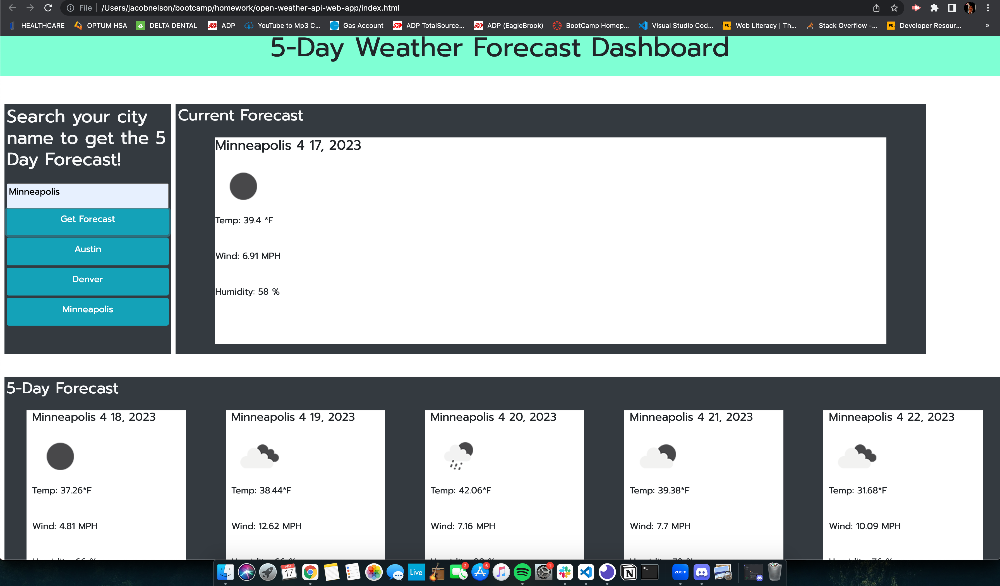

# open-weather-api-web-app

* This is my openweather API web app! This homework assignment we were supposed to access data from the OpenWeatherAPI and use it to create a five day forecast with searchable cities and search history.

## Links:

* [heres a link to the live webpage](https://jacobdnelsonstone.github.io/open-weather-api-web-app/)

